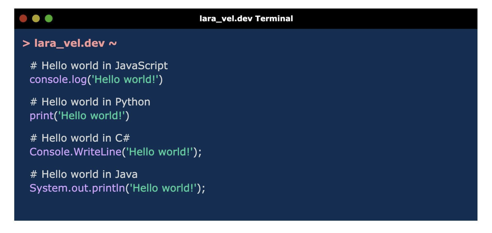

  <h1>Day 01: Hello World!</h1>

  <h2>Project</h2>
  
  
Terminal made with HTML and CSS that shows how to print hello world in JavaScript, Python, C# and Java.  

<h2>
Technologies
</h2>
  

    
  

